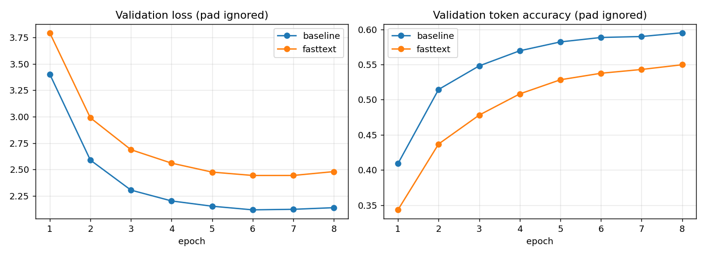

# English → French Neural Machine Translation — Modernised Word Representation

This project takes the seq2seq English→French translation notebook (BiLSTM
encoder, Luong attention, LSTM decoder) and modernises a single component of
it: the word representation feeding the encoder and decoder. The original
notebook represents every token purely by its index in a frequency-ranked
vocabulary, behind a randomly-initialised `nn.Embedding` table that has to
learn everything it knows about a word from the translation loss alone. This
project replaces that random initialisation with **FastText** word vectors
trained on the project's own corpus, while leaving the rest of the
architecture, data pipeline and training procedure untouched, and measures
whether the change actually helps.

It does not. On this dataset and training budget, the baseline
(frequency-based / randomly initialised embeddings) beats the
FastText-initialised model on every metric. That result, and the
investigation into why, is reported in full below — see
["Results"](#results) and ["Discussion"](#discussion).

The full pipeline is implemented as a reusable Python package (`src/`) and
two experiment scripts (`scripts/`); `notebooks/modernized_machine_translation.ipynb`
is an executed, end-to-end walkthrough that reloads the trained checkpoints
and recomputes BLEU/ROUGE live from the saved predictions, so every number
quoted in this README can be independently verified by re-running that
notebook's cells.

## Contents

- [Dataset](#dataset)
- [Embedding method: FastText](#embedding-method-fasttext)
- [Architecture](#architecture-bilstm-encoder--luong-attention--lstm-decoder)
- [Preprocessing](#preprocessing)
- [Training](#training)
- [Evaluation](#evaluation-bleu--rouge)
- [Results](#results)
- [Discussion](#discussion)
- [Additional technique: frozen-embedding ablation](#additional-technique-frozen-embedding-ablation)
- [Project layout](#project-layout)
- [Reproducing the results](#reproducing-the-results)
- [Known limitations](#known-limitations)

## Dataset

The parallel corpus is the same one the original notebook uses: the
tab-separated `eng-fra.txt` file of English/French sentence pairs built from
Tatoeba, distributed for the classic PyTorch "NLP From Scratch" seq2seq
tutorial (135,842 pairs after the original notebook's own deduplication).
This project trains on a fixed-size random subsample of the cleaned corpus
(**20,000 pairs**, seeded, drawn the same way the notebook's own
`WORKSHOP_MODE` draws its 40,000-pair subsample) rather than the full
corpus, purely because this project runs on a single CPU core instead of a
GPU — the subsample size is the one deliberate compute-driven deviation from
the notebook and is called out explicitly rather than left implicit.

After the standard 80/10/10 split (identical `random_state` to the
notebook's own split) the working set is:

| Split | Pairs |
|---|---|
| Train | 16,200 |
| Validation | 1,800 |
| Test | 2,000 |

Vocabulary (frequency-ranked, `max_vocab_size = 8,000`, built from the
training split only): **5,812** English word types, **8,000** French word
types (i.e. French hits the vocabulary cap; the remainder map to `<unk>`).

The dataset file itself is not committed to the repository (see
[Reproducing the results](#reproducing-the-results) for how to obtain it);
everything downstream of it — cleaning, splitting, vocabulary, embeddings,
model, training, evaluation — is scripted and deterministic given that file.

## Embedding method: FastText

Three modern word-embedding approaches were considered for replacing the
notebook's random `nn.Embedding` initialisation:

| Option | Why it was or wasn't chosen |
|---|---|
| **GloVe** | Built from a global co-occurrence matrix. High-quality pretrained vectors exist for English, but not through the same channel for French, and training GloVe from scratch means building and factorising a co-occurrence matrix — a separate, heavier procedure than the alternatives, for a corpus this small. Not selected. |
| **Word2Vec** | Learns dense vectors from local context windows and is a natural fit for a corpus we control end-to-end. However, it represents each word as an atomic unit: it cannot embed a word it never saw during training, and it shares no statistics between related word forms — a real limitation for French, which inflects heavily by gender, number and conjugation. Not selected. |
| **FastText** | Extends Word2Vec by representing each word as a bag of character n-grams, so morphologically related words (`travaille`, `travaillons`, `travaillé`) share sub-word statistics instead of being learned independently. It trains the same way Word2Vec does (cheap, self-contained, no multi-gigabyte external download required — important given this project's restricted network access) while being better suited to a morphologically rich target language and a small, domain-specific vocabulary. **Selected.** |

FastText embeddings are trained from scratch with `gensim.models.FastText`
**separately for English and French**, using only the training split (no
validation/test leakage), one model per language, with:

```text
vector_size = 256   (matches the model's embed_dim, no projection needed)
window      = 5
min_count   = 1
sg          = 1     (skip-gram)
min_n, max_n = 3, 6 (character n-gram range)
bucket      = 100,000
epochs      = 15
```

`bucket` (the number of hash buckets used for n-gram hashing) is set to
100,000 rather than gensim's default of 2,000,000: at this vocabulary size
the default allocates roughly 1 GB of memory per language for no measurable
benefit, which does not fit this project's memory budget.

The resulting vectors are used to initialise the encoder's source-language
embedding table and the decoder's target-language embedding table, aligned
to the same frequency-ranked vocabulary indices the baseline uses (only the
*initial values* behind those indices differ). Coverage was **100%** for
both languages — every vocabulary word had a FastText vector (guaranteed
here because FastText's sub-word hashing gives every training-set word a
vector by construction, and the vocabulary was itself built from the same
training split).

## Architecture: BiLSTM encoder + Luong attention + LSTM decoder

Unchanged from the original notebook:

- **Encoder** — a single-layer, bidirectional LSTM. The forward and
  backward final hidden/cell states are concatenated and used to initialise
  the decoder.
- **Attention** — Luong (dot-product) attention over all encoder time
  steps, masked so the decoder cannot attend to padding positions.
- **Decoder** — a single-layer, unidirectional LSTM whose hidden size
  matches the encoder's concatenated (`2 x hidden_dim`) output. At each
  step, the decoder's own output and the attention context vector are
  concatenated and projected to the vocabulary via a linear layer.
- **Training** — teacher forcing (the decoder is fed the true previous
  French token during training), cross-entropy loss with padding indices
  ignored, gradient clipping, Adam with `ReduceLROnPlateau`, and early
  stopping on validation loss with the best checkpoint restored at the end.
- **Inference** — greedy decoding, one token at a time, starting from
  `<start>` and stopping at `<end>` or a maximum length.

The only change is what sits behind `nn.Embedding`'s indices: the baseline
model uses PyTorch's default random initialisation (`Encoder`/`Decoder`
built with no `pretrained_embeddings` argument); the modernised model
initialises the same tables from the FastText matrices described above via
`nn.Embedding.from_pretrained(..., freeze=False)`, so the vectors continue
to be fine-tuned by the translation loss rather than staying fixed.

Hyperparameters (identical for both models, taken from the notebook's own
`WORKSHOP_MODE=True` configuration):

| Hyperparameter | Value |
|---|---|
| `embed_dim` | 256 |
| `hidden_dim` (encoder, per direction) | 256 |
| `decoder_hidden` | 512 |
| `max_seq_len` | 20 |
| `max_vocab_size` | 8,000 |
| `batch_size` | 64 |
| `dropout` | 0.2 |
| `learning_rate` | 1e-3 (Adam) |
| `grad_clip` | 1.0 |
| `epochs` (max) | 8 |
| `patience` (early stopping) | 3 |

Trainable parameters: 14,365,504 for both models (the embedding tables are
the same shape either way — only their initial values differ).

## Preprocessing

Text cleaning is carried over unchanged from the original notebook, since
the task is to modernise the word representation, not the text pipeline:

1. Lower-case.
2. Expand a fixed set of common English/French contractions (`don't` → `do
   not`, `c'est` → `ce est`, etc.).
3. Keep only letters (English: `a-z`; French: `a-z` plus accented
   characters `àâäçéèêëîïôùûüœÿ`) and whitespace; everything else
   (punctuation, digits) is stripped.
4. Collapse repeated whitespace.

No `<start>`/`<end>` tokens are baked into the raw strings — the
`Vocabulary` class adds them at encoding time, exactly as in the notebook.
No sentence-length filtering is applied at the cleaning stage either
(matching the notebook); over-length sentences are silently truncated to
`max_seq_len` tokens by the vocabulary's own encoding step, which is the
notebook's original behaviour.

## Training

Both models are trained under **identical** conditions — same data split,
same vocabulary, same architecture, same hyperparameters, same random seed
for weight initialisation and mini-batch order — so that any difference in
outcome can be attributed to the embedding initialisation and nothing else.

Validation loss and token accuracy per epoch:



| Epoch | Baseline val loss | Baseline val acc | FastText val loss | FastText val acc |
|---|---|---|---|---|
| 1 | 3.403 | 0.409 | 3.794 | 0.343 |
| 2 | 2.590 | 0.514 | 2.990 | 0.437 |
| 3 | 2.305 | 0.548 | 2.688 | 0.478 |
| 4 | 2.203 | 0.570 | 2.561 | 0.508 |
| 5 | 2.153 | 0.582 | 2.476 | 0.528 |
| 6 | **2.119** | 0.588 | 2.444 | 0.538 |
| 7 | 2.124 | 0.590 | **2.444** | 0.543 |
| 8 | 2.139 | 0.595 | 2.481 | 0.550 |

Both models ran the full 8 epochs (early stopping did not trigger; best
validation loss was at epoch 6 for the baseline and epoch 7 for FastText,
and each model's best checkpoint — not necessarily the last epoch — is what
gets evaluated on the test set). Training took ~28.5 minutes (baseline) and
~25.0 minutes (FastText-initialised) on a single CPU core.

## Evaluation: BLEU + ROUGE

Both models are evaluated on the same 2,000-sentence held-out test set with
greedy decoding, using:

- **BLEU** — corpus-level BLEU via `sacrebleu` (0–100 scale).
- **ROUGE-1 / ROUGE-2 / ROUGE-L** — per-sentence F-measure via
  `rouge-score`, averaged over the test set (reported as percentages).

Both metrics are computed on the model's native output space: lower-cased,
punctuation-stripped, whitespace-tokenised French — the same normalisation
used throughout training, so the comparison between the two models is
apples-to-apples. This also means these BLEU/ROUGE numbers are **not**
directly comparable to numbers reported elsewhere on cased, punctuated
text. ROUGE is computed **without** the English Porter stemmer that
`rouge-score` uses by default, since applying an English stemmer to French
text would silently corrupt the metric.

## Results

| Metric | Baseline (frequency-based) | FastText-initialised | Δ (FastText − baseline) |
|---|---|---|---|
| BLEU | **25.36** | 18.77 | −6.59 (−26.0%) |
| ROUGE-1 | **53.27** | 44.48 | −8.79 (−16.5%) |
| ROUGE-2 | **32.08** | 24.72 | −7.37 (−23.0%) |
| ROUGE-L | **52.20** | 43.54 | −8.66 (−16.6%) |
| Test loss | **2.049** | 2.390 | +0.342 (+16.7%) |
| Test token accuracy | **0.599** | 0.541 | −0.057 (−9.5%) |

**The baseline outperforms the FastText-initialised model on every metric
at this scale.** Full per-sentence predictions for both models on the
entire test set are saved at `results/test_set_translations.csv`; a few
representative examples:

| English | Reference | Baseline | FastText-init |
|---|---|---|---|
| he still has not responded | il n a toujours pas répondu | il ne est toujours pas | il ne est toujours pas |
| the book is on the table | l ouvrage se trouve sur la table | le livre est sur la table | le livre est sur le livre |
| take whichever of these you want | prends n importe lequel que tu veux parmi ceux ci | prends le nombre de ceux là | prends toi de ce que tu veux |
| i was in good spirits | j étais de bonne humeur | je ai été en bonne | je suis bon |
| i just had a talk with your teacher | je viens d avoir une conversation avec ton professeur | je viens d avoir un conversation avec ton institutrice | je viens d être professeur avec votre avocat |

Both models struggle on longer or less common sentences (as expected at
this vocabulary/data scale), but the FastText-initialised model's outputs
drift further from the reference's meaning on average — e.g. "the table" →
"le livre" (the book), a straightforward content-word substitution error
that is symptomatic of a weaker learned mapping from source to target
content words.

## Discussion

The measured result — fine-tuned FastText initialisation underperforming a
random baseline — is real and reproducible with the checked-in seeds; it is
reported as-is rather than reframed as a partial success. A few concrete,
evidence-backed observations about why:

1. **The gap is present from epoch 1 and persists throughout training.**
   At epoch 1, the FastText-initialised model's training loss (5.06) is
   already higher than the baseline's (4.73), and validation accuracy is
   9.6 points lower (0.343 vs 0.409). Whatever the FastText vectors encode,
   it is not a better starting point for *this* task on *this* data than
   the network's own random initialisation.

2. **The gap narrows but does not close within the trained budget.** The
   validation-accuracy gap shrinks from 6.6 points (epoch 1) to 4.5 points
   (epoch 8), and neither model's validation loss had fully plateaued
   (baseline dips at epoch 6 then rises slightly; FastText is still
   improving at epoch 7). More epochs might narrow the gap further, but
   there is no evidence in the data collected here that it would close or
   reverse, so no such claim is made.

3. **100% vocabulary coverage rules out an "OOV" explanation.** Every
   vocabulary word had a trained FastText vector (the embeddings were
   trained on the same sentences the vocabulary was built from), so the
   underperformance is not caused by falling back to random/zero vectors
   for unseen words — a common failure mode this design deliberately
   avoids but that turned out not to be the bottleneck here.

4. **The FastText vectors themselves, not fine-tuning dynamics, are the
   more likely explanation.** A natural hypothesis is that fine-tuning is
   distorting otherwise-useful pretrained vectors faster than the small
   parallel corpus can put back task-specific signal. The frozen-embedding
   ablation below tests this directly by removing fine-tuning entirely --
   and the frozen model performs *worse* still, which rules that
   hypothesis out. See
   ["Additional technique: frozen-embedding ablation"](#additional-technique-frozen-embedding-ablation)
   for the full argument.

## Additional technique: frozen-embedding ablation

To isolate whether **fine-tuning** the FastText vectors (rather than
FastText itself) is responsible for the gap, a third model was trained
under identical conditions with the FastText embeddings **frozen**
(`nn.Embedding.from_pretrained(..., freeze=True)`) — i.e. the model can
only adapt its LSTM, attention and output-projection weights, not the word
vectors themselves.

| Metric | Baseline | FastText (fine-tuned) | FastText (frozen) |
|---|---|---|---|
| BLEU | **25.36** | 18.77 | 15.42 |
| ROUGE-1 | **53.27** | 44.48 | 40.92 |
| ROUGE-2 | **32.08** | 24.72 | 21.07 |
| ROUGE-L | **52.20** | 43.54 | 40.08 |
| Test loss | **2.049** | 2.390 | 2.623 |
| Test token accuracy | **0.599** | 0.541 | 0.506 |

**The frozen variant is the weakest of the three**, not the strongest. This
is an informative negative result: it rules out the "fine-tuning is
corrupting otherwise-good vectors" hypothesis raised in the Discussion
above. If that hypothesis were correct, freezing the embeddings should have
*closed* the gap with the baseline (by protecting the FastText vectors from
harmful task-specific drift); instead it widened it further, because a
frozen embedding table also blocks the network from doing the one thing
that clearly matters most here — adapting its word representations to the
translation objective using the available parallel data. Taken together
with the fine-tuned result, the evidence points to a simpler explanation
than a fine-tuning failure mode: at this corpus size (16,200 sentence
pairs, single-domain, informal conversational English/French), FastText
vectors trained from scratch on the same small corpus do not carry
enough transferable signal to out-perform embeddings learned directly and
end-to-end from the translation objective, and constraining them further
(freezing) only removes capacity the model needs.

This also clarifies what this comparison does and does not show: it is not
evidence against FastText or word-embedding pretraining in general (which
consistently helps when the embeddings are pretrained on a corpus much
larger and/or more diverse than the task's own training data — the
standard use case for pretrained embeddings). It is evidence that
*self-training* FastText on the same small, narrow corpus the translation
model already sees offers no additional information for the model to
exploit, and that the fairest test of "does modernising the embedding
layer help" is exactly the controlled comparison performed here rather
than an assumption that any embedding upgrade is automatically better.

## Project layout

```
mt_project/
├── README.md
├── requirements.txt
├── data/
│   ├── raw/                 # eng-fra.txt goes here (not committed)
│   └── processed/           # train/val/test splits (generated)
├── src/
│   ├── config.py             # paths, hyperparameters
│   ├── text_cleaning.py       # cleaning rules (from the original notebook)
│   ├── data_prep.py           # dataset loading, cleaning, splitting
│   ├── vocabulary.py          # frequency-ranked Vocabulary class
│   ├── embeddings.py          # FastText training + embedding matrix build
│   ├── dataset.py             # PyTorch Dataset / DataLoader
│   ├── model.py               # Encoder, LuongAttention, Decoder, Seq2Seq
│   ├── train.py               # training loop, early stopping, checkpointing
│   ├── inference.py           # greedy decoding
│   ├── evaluate.py            # BLEU + ROUGE
│   └── utils.py               # seeding, plotting
├── scripts/
│   ├── run_experiment.py      # trains + evaluates baseline and FastText models
│   └── run_frozen_ablation.py # trains + evaluates the frozen-embedding ablation
├── notebooks/
│   └── modernized_machine_translation.ipynb   # end-to-end walkthrough
└── results/
    ├── baseline/               # model.pt, history.json, metrics.json
    ├── fasttext/                # model.pt, history.json, metrics.json, embedding_matrices.npz
    ├── fasttext_frozen/          # ablation results
    ├── figures/validation_curves.png
    ├── test_set_translations.csv
    └── comparison.json
```

## Reproducing the results

1. **Install dependencies** (Python 3.10+):

   ```bash
   pip install -r requirements.txt
   ```

2. **Obtain the dataset.** Download the original English-French corpus used
   by the workshop notebook — the `eng-fra.txt` file distributed as part of
   `download.pytorch.org/tutorial/data.zip` for the PyTorch "NLP From
   Scratch" seq2seq tutorial — and place it at:

   ```
   data/raw/eng-fra.txt
   ```

   It is a tab-separated file, one English/French sentence pair per line
   (135,842 lines).

3. **Run the main experiment** (prepares the data, trains the baseline and
   FastText-initialised models, evaluates both with BLEU/ROUGE, writes all
   result artifacts):

   ```bash
   python scripts/run_experiment.py
   ```

   This is resumable: if interrupted, re-running the same command picks up
   from the last completed training epoch rather than starting over. Pass
   `--force` to ignore any cached data/checkpoints and start clean, or
   `--quick` for a fast smoke test on a tiny subset.

4. **Run the frozen-embedding ablation** (optional, requires step 3 to have
   completed at least through the FastText embedding-training stage):

   ```bash
   python scripts/run_frozen_ablation.py
   ```

5. **Inspect results** under `results/`: `comparison.json` for the headline
   numbers, `test_set_translations.csv` for every test-set prediction from
   both models, `figures/validation_curves.png` for the training curves.

The full walkthrough is also available as a notebook at
`notebooks/modernized_machine_translation.ipynb`.

## Known limitations

- **Subsample size.** Training uses 20,000 of the 130k+ cleaned pairs
  (documented above) purely for single-CPU training time; results on the
  full corpus, or with a GPU-scale training budget, could differ.
- **Training budget.** 8 epochs (matching the notebook's own
  `WORKSHOP_MODE`) was enough to reach a stable validation loss for the
  baseline but the FastText model's validation loss had not yet fully
  plateaued; the reported comparison is only valid at this training budget
  and is not a claim about the two approaches' behaviour at convergence.
- **Evaluation normalisation.** BLEU/ROUGE are computed on lower-cased,
  punctuation-stripped text (the model's native output space), not on
  cased/punctuated text, and are only meaningful as a relative comparison
  between the two models trained here — not as an absolute benchmark
  against other published English→French systems.
