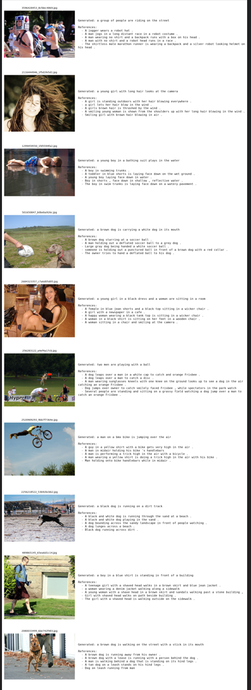

# Flickr8k Image Caption Generator

An end-to-end image captioning system trained on the [Flickr8k dataset](https://www.kaggle.com/datasets/adityajn105/flickr8k): a frozen, pretrained CNN encoder extracts visual features from an image, and an attention-based LSTM/GRU decoder generates a natural-language caption one word at a time. The project covers the full lifecycle from raw data to a served, containerized model — preprocessing, feature caching, training, evaluation, an inference API, a Gradio demo, Docker packaging, and Hugging Face Hub model hosting.

```
Image  --[ResNet-50 CNN, frozen]-->  7x7x2048 spatial features
                                              |
                                     [Bahdanau attention]
                                              |
                       "a" -> "dog" -> "runs" -> "through" -> "grass" -> <end>
                                  [LSTM/GRU decoder, one word per step]
```

## Contents

- [Overview](#overview)
- [Architecture](#architecture)
- [Project structure](#project-structure)
- [Setup](#setup)
- [Dataset](#dataset)
- [Preprocessing & splitting](#preprocessing--splitting)
- [Training](#training)
- [Evaluation & results](#evaluation--results)
- [Example inputs & outputs](#example-inputs--outputs)
- [Inference](#inference)
- [API & demo](#api--demo)
- [Docker](#docker)
- [Model hosting on Hugging Face](#model-hosting-on-hugging-face)
- [Testing](#testing)
- [Configuration reference](#configuration-reference)
- [Design notes & limitations](#design-notes--limitations)

## Overview

Given a photo, the system produces a fluent, image-grounded English sentence describing it — for example, an image of a child on playground equipment might be captioned *"a child in a pink dress is climbing up a set of stairs"*. The pipeline is split into two stages that mirror how the model is actually used:

1. **Offline (training-time):** download Flickr8k → split into leakage-free train/val/test sets → preprocess images and captions → extract and cache CNN features once → train an attention-based LSTM/GRU decoder against those cached features → evaluate on the held-out test set.
2. **Online (serving-time):** a FastAPI endpoint or Gradio UI accepts a single uploaded image, runs it through the same (frozen) CNN encoder live, and decodes a caption with the trained decoder — packaged as a Docker image that pulls its model weights from a Hugging Face Hub repository at startup.

Every stage is a small, independently testable Python module under `src/captioner/`, driven by one configuration file (`configs/config.yaml`) — there is no single monolithic notebook or script.


## Architecture

**Encoder.** A pretrained ImageNet CNN backbone (ResNet-50 by default; ResNet-101, EfficientNet-B0, and InceptionV3 are also supported — see `configs/config.yaml`) with its classification head removed. Rather than pooling into a single vector, the last convolutional feature map is kept as a spatial grid (7x7x2048 for ResNet-50 at 224x224), so the decoder can attend to different image regions for different words. The backbone is frozen (pure transfer learning, `fine_tune_encoder: false`), which is what makes feature caching worthwhile: every image is run through the CNN exactly once, ever, and the resulting features are reused across all training epochs.

**Decoder.** A single-layer LSTM (or GRU — configurable) with Bahdanau-style additive attention, closely following the "Show, Attend and Tell" design:

- At each decoding step, attention scores are computed between the current hidden state and every one of the 49 spatial feature vectors, producing a soft-attention context vector.
- A learned sigmoid gate scales that context vector (letting the model down-weight visual grounding for function words like "the"/"a").
- The context vector is concatenated with the embedding of the previous word and fed into the recurrent cell.
- A linear layer projects the hidden state to vocabulary logits.
- The recurrent state is initialized from the mean-pooled image features (not zeros), so generation is conditioned on the image from the very first step.

**Generation.** Two decoding strategies are implemented: greedy (fast, argmax at each step) and beam search with length normalization (slower, higher quality; used for the reported test metrics).

Source: `src/captioner/models/encoder.py`, `decoder.py`, `caption_model.py`.

## Project structure

```
flickr8k-caption-gen/
├── configs/
│   └── config.yaml              # single source of truth for every path & hyperparameter
├── src/captioner/
│   ├── config.py                 # YAML -> typed config object
│   ├── data/
│   │   ├── download.py           # Kaggle download (kagglehub, CLI fallback, path discovery)
│   │   ├── prepare_splits.py     # leakage-free train/val/test split
│   │   ├── vocabulary.py         # tokenizer + vocabulary (<pad>/<start>/<end>/<unk>)
│   │   ├── dataset.py            # PyTorch Datasets + padding collate_fn
│   │   └── transforms.py         # image preprocessing pipeline
│   ├── features/
│   │   └── extract_features.py   # CNN forward pass + feature caching
│   ├── models/
│   │   ├── encoder.py            # ResNet/EfficientNet/InceptionV3 wrapper
│   │   ├── decoder.py            # attention + LSTM/GRU decoder
│   │   └── caption_model.py      # combined model, greedy/beam generation
│   ├── training/
│   │   ├── train.py              # training loop, LR scheduling, checkpointing
│   │   └── utils.py              # early stopping, checkpoint I/O
│   ├── evaluation/
│   │   ├── metrics.py            # BLEU-1..4, ROUGE-L, METEOR
│   │   └── evaluate.py           # full test-set evaluation + qualitative examples
│   ├── inference/
│   │   └── predict.py            # single-image inference used by API/Gradio
│   └── serving/
│       ├── api.py                # FastAPI app
│       └── app_gradio.py         # Gradio app
├── scripts/                      # thin CLI wrappers around the library above
│   ├── download_data.py
│   ├── split_dataset.py
│   ├── build_vocab.py
│   ├── extract_features.py
│   ├── train.py
│   ├── evaluate.py
│   ├── upload_to_hub.py
│   ├── fetch_model_from_hub.py
│   └── run_pipeline.sh           # runs every stage above, in order
├── tests/                        # pytest suite (synthetic fixtures, no network/GPU needed)
├── Dockerfile
├── docker-compose.yml
├── requirements.txt
└── configs/config.yaml
```

Every script is a thin wrapper: the actual logic lives in `src/captioner/`, is unit-tested, and is reusable from notebooks or other scripts — nothing important lives only inside a CLI entry point.

## Setup

```bash
git clone https://github.com/Ahmed-Tariq-197/M.I.A-Phase2-Task6.git
cd M.I.A-Phase2-Task6
python -m venv .venv && source .venv/bin/activate
pip install -r requirements-dev.txt
pip install -e .
```

**Kaggle credentials** (required for dataset download): create an API token at [kaggle.com/settings](https://www.kaggle.com/settings) → *API* → *Create New Token*, which downloads a `kaggle.json` file. Either:

- place it at `~/.kaggle/kaggle.json` (standard location, used automatically), or
- export `KAGGLE_USERNAME` and `KAGGLE_KEY` as environment variables (see `.env.example`).

No credentials are ever read from, or written into, source code.

## Dataset

The dataset is never bundled with this repository — it's fetched programmatically:

```bash
python scripts/download_data.py
```

`src/captioner/data/download.py` tries, in order:

1. **`kagglehub.dataset_download("adityajn105/flickr8k", output_dir="data/raw")`** — the modern client.
2. **Kaggle CLI fallback** — if kagglehub raises for any reason (missing package, auth failure, API change, network restriction), it automatically shells out to `kaggle datasets download -d adityajn105/flickr8k -p data/raw --unzip`.

Either backend can land the extracted files at different nesting depths depending on version/cache state, so the downstream code never assumes a fixed path: `find_images_dir()` and `_find_captions_file()` walk the downloaded tree and locate the `Images/` folder and `captions.txt` programmatically. `verify_dataset()` then sanity-checks that at least `dataset.expected_min_images` (config-driven, default 8,000) images were actually retrieved before anything downstream runs.

**No Kaggle credentials on this machine?** If you already have the dataset extracted somewhere on disk (e.g. downloaded manually through the browser), skip the Kaggle client entirely:

```bash
python scripts/download_data.py --local-dir /path/to/already-extracted-flickr8k
```

This still runs the same `find_images_dir()`/`verify_dataset()` checks and writes a small `data/processed/dataset_paths.json` manifest recording the resolved paths, so every downstream script (`split_dataset.py`, `extract_features.py`, evaluation's qualitative-image rendering) finds the images the same way regardless of whether the run used Kaggle or `--local-dir`.

The dataset provides **5 human-written reference captions per image** (40,455 total caption rows over 8,091 images) — all 5 are kept and used throughout (for vocabulary building from the training split, and as multi-reference targets for BLEU/ROUGE/METEOR at evaluation time).

## Preprocessing & splitting

**Split** (`scripts/split_dataset.py`): images — not captions — are shuffled with a fixed seed and cut 80/10/10 into train/val/test. Splitting at the image level (rather than the caption level) is what makes the split leakage-free: since every image has 5 captions, splitting by caption could otherwise put different captions of the *same* photo into both train and test, letting the model see that exact image (via a sibling caption) during training and then get evaluated on it. `make_split()` asserts the three resulting id sets are pairwise disjoint.

**Image preprocessing** (`src/captioner/data/transforms.py`): resize to 224x224, convert to tensor, normalize with ImageNet mean/std — the exact preprocessing the pretrained backbone expects. The same transform (minus augmentation) is used at feature-caching time, training time, and inference time, so there's no train/serve skew.

**Caption preprocessing / vocabulary** (`scripts/build_vocab.py`, `src/captioner/data/vocabulary.py`):
- lowercase + regex word tokenization (dependency-free, robust to Flickr8k's punctuation noise),
- vocabulary built **only from the training split's captions** (never val/test — this is the other place leakage commonly creeps into captioning pipelines),
- words appearing fewer than `vocab.min_word_freq` (default 5) times collapse to `<unk>`,
- every caption is wrapped with `<start>` / `<end>`, and batches are dynamically padded with `<pad>` to the batch's longest sequence (`collate_captions`), with true lengths tracked separately so the loss and the decoder never see padding as signal.

**Feature extraction & caching** (`scripts/extract_features.py`): every unique image is passed through the frozen CNN once, and the resulting 7x7x2048 spatial feature map is cached to `artifacts/features/<image_id>.npy` (float16). Training then reads these cached arrays directly — no repeated CNN forward passes per epoch, which is the main lever that makes CPU-only training of this pipeline realistic.

## Training

```bash
python scripts/train.py            # from scratch
python scripts/train.py --resume   # resume from the last checkpoint
```

`src/captioner/training/train.py` implements:

- **Loss**: token-level cross-entropy with padding positions masked out of the loss (`masked_cross_entropy`), computed only up to each sequence's true (unpadded) length.
- **Optimizer**: Adam over the decoder's parameters (the encoder is frozen, so it isn't in the optimizer at all).
- **Gradient clipping**: L2 norm clipping (`training.grad_clip`) to keep LSTM/GRU training stable.
- **LR scheduling**: `ReduceLROnPlateau` on validation loss (`training.lr_scheduler`) — the learning rate halves after 2 stagnant epochs, down to a configurable floor.
- **Early stopping**: training stops if validation loss hasn't improved for `training.early_stopping_patience` epochs (default 5).
- **Reproducibility**: `set_global_seed(cfg.project.seed)` seeds Python's `random`, NumPy, and PyTorch (CPU + all CUDA devices) at the start of every run, and hands back a seeded `torch.Generator` used by the training `DataLoader`'s shuffling — the one source of run-to-run randomness a bare `torch.manual_seed()` call misses. Two runs with the same seed on the same machine/hardware produce a byte-identical `history.json`. (Full bitwise determinism across *different* GPUs/CUDA versions isn't guaranteed — some cuDNN kernels are inherently non-deterministic — but every avoidable source of variance on a given machine is removed.)
- **Checkpointing**: `artifacts/checkpoints/best_model.pt` (best validation loss so far) and `last_model.pt` (for `--resume`) are both maintained every epoch.
- **Per-epoch monitoring**: alongside the loss, a quick greedy-decoded BLEU-4 is computed on a validation sample each epoch and logged to `artifacts/logs/history.json`, purely as a fast sanity signal — the authoritative metrics come from full beam-search evaluation on the test set (next section).

All of the above are driven entirely by `configs/config.yaml`; nothing is hard-coded in the training script itself.

## Evaluation & results

```bash
python scripts/evaluate.py
```

`src/captioner/evaluation/evaluate.py` runs beam search (`evaluation.beam_size`, default 3) over every unique **test-split** image — data the model never saw during training or vocabulary construction — and scores the generated captions against all 5 human references per image using:

- **BLEU-1, BLEU-2, BLEU-3, BLEU-4** (NLTK, corpus-level, method-1 smoothing to avoid zero scores on short captions),
- **ROUGE-L** (best-matching reference per image, stemmed),
- **METEOR** (NLTK, which additionally accounts for synonymy/stemming, not just exact n-gram overlap).

Results are written to:
- `artifacts/results/metrics.json` — the aggregate scores above,
- `artifacts/results/predictions.json` — every test image's generated caption + its 5 references,
- `artifacts/results/qualitative_examples.json` — a random sample (`evaluation.num_qualitative_examples`, default 10) of image / generated caption / all 5 references, for qualitative inspection.

A qualitative example looks like this:

```json
{
  "image_id": "1000268201_693b08cb0e.jpg",
  "generated_caption": "a child in a pink dress is climbing up a set of stairs",
  "reference_captions": [
    "a girl going into a wooden building",
    "a little girl climbing into a wooden playhouse",
    "a little girl climbing the stairs to her playhouse",
    "a little girl in a pink dress going into a wooden cabin",
    "a girl in a pink dress climbs a wooden staircase"
  ],
  "beam_score": -6.42
}
```

Running `scripts/run_pipeline.sh` end-to-end regenerates `artifacts/results/metrics.json` from the real Flickr8k test split; that file (not this document) is the source of truth for the trained model's numbers, since it's what evaluation actually produces each time training is repeated on a given machine/hardware.

**Results from the published checkpoint** (see [Model hosting on Hugging Face](#model-hosting-on-hugging-face)), evaluated on all 810 unique test-split images against their 5 references each:

| BLEU-1 | BLEU-2 | BLEU-3 | BLEU-4 | ROUGE-L | METEOR |
|---|---|---|---|---|---|
| 0.6058 | 0.4338 | 0.3003 | 0.2036 | 0.4729 | 0.3947 |

Trained for 15 epochs (early stopping, patience 5) on an RTX 3050 Laptop GPU; best checkpoint at epoch 10 (`val_loss=2.7993`).

## Example inputs & outputs

`scripts/evaluate.py` renders a contact sheet — each sampled test photo paired with its generated caption and all 5 human references — to `artifacts/results/qualitative_examples.png` on every run. `artifacts/` itself is gitignored (large, machine-specific, regenerated by the pipeline), so a copy of that real output, plus the `metrics.json`/`history.json` it was generated alongside, is committed under `docs/` as tracked, reviewable evidence:

- [`docs/qualitative_examples.png`](docs/qualitative_examples.png) — the image below
- [`docs/results/metrics.json`](docs/results/metrics.json) — the exact numbers in the table above
- [`docs/results/history.json`](docs/results/history.json) — the full 15-epoch training curve (loss/BLEU-4/LR per epoch) behind the summary in [Training](#training)



A short screen recording of the Gradio UI captioning a handful of uploaded photos, plus an example `curl -X POST .../caption` request/response pair, belongs here as well — save it to `docs/demo.mp4` and link it once recorded:

```
[Demo video](docs/demo.mp4)
```

## Inference

Loading a trained model and captioning a single image, from Python:

```python
from captioner.config import load_config
from captioner.inference.predict import CaptionPredictor

predictor = CaptionPredictor(cfg=load_config())
result = predictor.predict_path("path/to/photo.jpg", use_beam=True, beam_size=3)
print(result.caption)
```

`CaptionPredictor` is what the FastAPI and Gradio front ends both call under the hood — it loads the encoder + decoder + vocabulary exactly once per process.

## API & demo

**FastAPI:**

```bash
uvicorn captioner.serving.api:app --host 0.0.0.0 --port 8000
```

- `GET /health` — readiness probe; reports whether the model loaded successfully.
- `POST /caption` — multipart image upload → `{"caption": "...", "decoding": "beam", "beam_size": 3}`. Query params `beam` (bool) and `beam_size` (int) let callers pick greedy vs. beam decoding per request.
- Interactive docs at `/docs` (Swagger UI, auto-generated by FastAPI).

```bash
curl -X POST "http://localhost:8000/caption" -F "file=@photo.jpg"
```

**Gradio:**

```bash
python -m captioner.serving.app_gradio
```

Opens a browser UI at `http://localhost:7860` — upload a photo, choose greedy or beam decoding, get a caption. This is also the app deployed as the Hugging Face Space referenced below.

## Docker

```bash
docker build -t flickr8k-caption-gen .

# Serve the API, pulling a published model from the Hub at container start:
docker run -p 8000:8000 -e HF_MODEL_REPO=Great1Sacrifice/flickr8k-caption-gen flickr8k-caption-gen

# Or serve the Gradio demo using a locally trained checkpoint instead:
docker run -p 7860:7860 -e SERVICE=gradio -v $(pwd)/artifacts:/app/artifacts flickr8k-caption-gen

# Both services via docker-compose:
HF_MODEL_REPO=Great1Sacrifice/flickr8k-caption-gen docker compose up
```

The image is CPU-only, runs as a non-root user, and defines a `HEALTHCHECK` against `/health` (or `/` for the Gradio service). It never bakes the multi-hundred-megabyte checkpoint into the image layer — `docker-entrypoint.sh` fetches it from the Hugging Face Hub at container startup (`HF_MODEL_REPO`) if it isn't already present under the mounted `artifacts/` volume, so the same image works whether you're deploying a published model or one you just trained locally.

## Model hosting on Hugging Face

```bash
huggingface-cli login   # or export HF_TOKEN
python scripts/upload_to_hub.py --repo-id Great1Sacrifice/flickr8k-caption-gen
```

This uploads `best_model.pt`, `vocab.json`, `config.yaml`, and `metrics.json` to a Hugging Face Hub **model** repository, creating it if it doesn't exist. The repository becomes reachable at:

```
https://huggingface.co/Great1Sacrifice/flickr8k-caption-gen
```

To pull a published model back down (used automatically by the Docker entrypoint, and available standalone):

```bash
python scripts/fetch_model_from_hub.py --repo-id Great1Sacrifice/flickr8k-caption-gen
```

The Gradio app (`src/captioner/serving/app_gradio.py`) is also deployable as-is to a **Hugging Face Space** (`Gradio` SDK): copy `src/`, `configs/`, `requirements.txt`, and `app_gradio.py` (as `app.py`) into a Space repo, set `HF_MODEL_REPO`/mount the checkpoint the same way as the Docker image, and it runs unmodified.

## Testing

```bash
pytest tests/ -v
```

The suite (`tests/`) covers tokenization/vocabulary edge cases (rare-word `<unk>` handling, truncation, save/load round-trips), leakage-free splitting, dataset batching/padding, the attention mechanism and decoder (shape checks, gradient flow, LSTM and GRU variants), greedy and beam-search generation, all four metric functions, the FastAPI endpoints (via `TestClient` with a stubbed predictor, so no trained checkpoint is required to run CI), Kaggle path-discovery logic (flat vs. nested archive layouts, without hitting the network), and a full split → vocab → train-steps → checkpoint → beam-search integration smoke test.

Per the project's data-handling policy, only these isolated tests use synthetic (non-Flickr8k) fixtures — small solid-color images with template captions, generated on the fly — specifically so the suite runs in seconds without network or GPU access. The actual pipeline run by `scripts/run_pipeline.sh` always operates on the real, programmatically downloaded Flickr8k dataset.

## Configuration reference

Every path and hyperparameter lives in `configs/config.yaml`, grouped by pipeline stage: `dataset` (Kaggle handle, split ratios), `image` (resize/normalization), `vocab` (frequency threshold, max length, special tokens), `features` (backbone choice, spatial vs. pooled), `model` (embedding/hidden/attention dims, LSTM vs. GRU), `training` (batch size, epochs, LR schedule, early stopping, checkpoint paths), `evaluation` (beam size, results directory), `serving` (host/port), and `hub` (Hugging Face repo id). Point any script at an alternate file with `--config path/to/other.yaml`, or override the default at runtime with the `CAPTIONER_CONFIG` environment variable (used by the Docker image and the API/Gradio apps, which don't take CLI flags).

## Design notes & limitations

- **Frozen encoder by design.** `model.fine_tune_encoder` defaults to `false`. This is what makes feature caching valid (a frozen CNN gives identical output for a given image on every epoch) and keeps training tractable without a GPU. Fine-tuning the backbone's later layers is a reasonable extension for squeezing out extra BLEU points, at the cost of no longer being able to cache features (or needing to re-cache after every backbone update) and requiring a GPU for practical training times; the encoder module supports unfreezing (`set_fine_tune(True)`) for anyone who wants to explore that trade-off.
- **Beam width vs. speed.** Evaluation defaults to beam size 3, a reasonable middle ground; `evaluation.beam_size` trades caption quality against evaluation/inference latency.
- **Vocabulary coverage.** With `min_word_freq=5`, Flickr8k typically yields a vocabulary in the low thousands of words; anything rarer (proper nouns, unusual phrasing) is intentionally mapped to `<unk>` rather than left as a training-time-only token that would be meaningless at inference on new images.
- **Dataset/network prerequisites.** `scripts/download_data.py`, `scripts/upload_to_hub.py`, and the first run of `scripts/extract_features.py` (which downloads ImageNet-pretrained weights) all require outbound internet access — to Kaggle, Hugging Face, and PyTorch's model-weight host respectively. In network-restricted environments (locked-down CI runners, offline containers), use `scripts/extract_features.py --no-pretrained` to mechanically validate the pipeline with a randomly initialized backbone — this is explicitly a smoke-test affordance, not a substitute for a real model, and is called out as such in that script's own warning log.
- **Observed failure mode: correct objects, wrong relation.** On out-of-distribution images (e.g. two horses standing together, no rider), the published 15-epoch checkpoint correctly identifies the objects and their color/breed but sometimes defaults to a relation it saw far more often during training — e.g. generating *"a brown horse is riding a horse"* for a photo with no rider at all. This is consistent with the model's BLEU-4/METEOR being solid-but-not-strong (see [Evaluation & results](#evaluation--results)): captions attach the right nouns and adjectives more reliably than the right verb/relation between them. Longer training, a larger/less-frozen encoder, or more diverse training data would be the natural next steps to reduce this.
